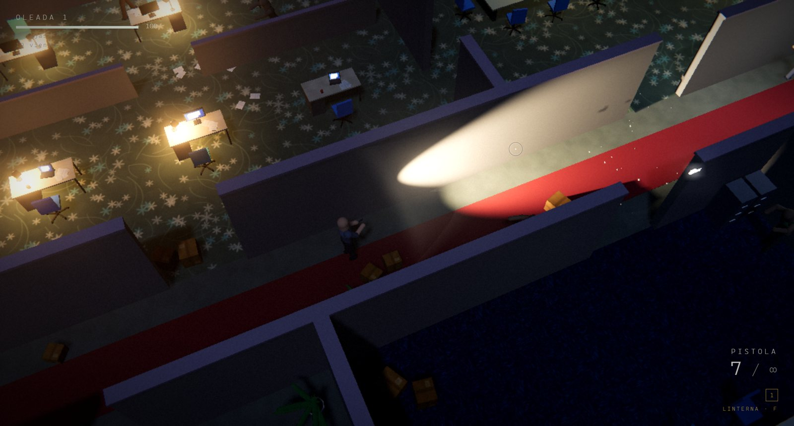
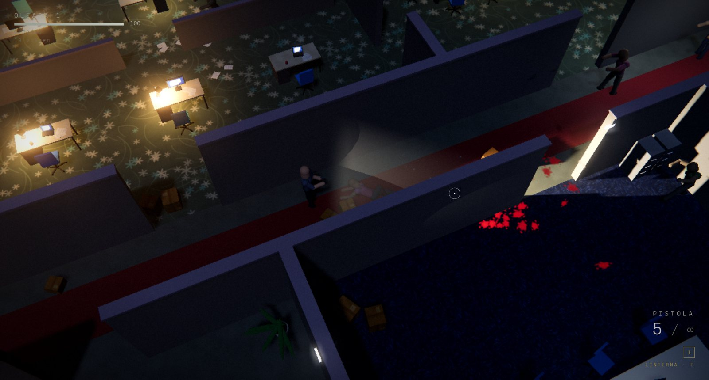
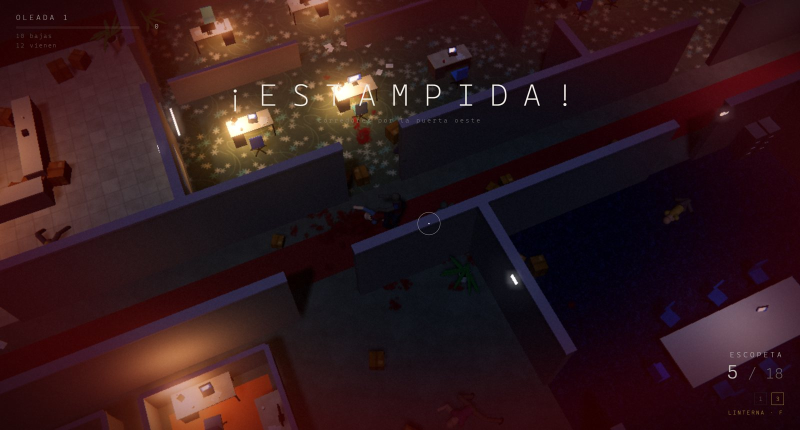

<div align="center">

# CARRONA

**Zombis top-down en una oficina de noche. Todos los cuerpos son ragdoll activo, todo el tiempo.**

Motor de física propio, músculos que son controladores PD, marcha por cinemática inversa,
horda que corre, choca, tropieza y se levanta. Un `index.html`, módulos ES, Three.js vendorizado.
Cero dependencias que instalar, cero archivos de textura o de sonido: todo es procedural.




</div>

## Qué es

Un shooter de oleadas visto desde arriba. La gracia no está en las armas sino en los cuerpos:
no hay ni un solo clip de animación en el proyecto. Cada zombi y el jugador son un esqueleto
de partículas que la física mueve, y lo único que cambia entre "camina", "corre", "se estrella
contra la pared" y "muere" es cuánta fuerza hace cada músculo para llegar a su pose. Un tiro
en el brazo apaga ese brazo. Una escopeta de frente lo tira de espaldas; por la espalda, de boca.
Un corredor que pega contra un escritorio queda colgado de él y después se levanta.

<div align="center">

|  |  |
|:--:|:--:|
| linterna, sangre y cuerpos que caen con su inercia | estampida de corredores por una puerta |

</div>

## Jugar

Doble clic en **`Jugar CARRONA.bat`**: levanta un servidor local en el puerto 8765 y abre el
navegador. `Jugar CARRONA (sin consola).vbs` hace lo mismo sin ventana negra. Hace falta
Python 3 en el PATH y Chrome o Edge. Los módulos ES no cargan desde `file://`, por eso el servidor.

| Tecla | Acción |
|---|---|
| WASD / flechas | moverse (relativo a la cámara) |
| Shift | correr (el arma baja, el cuerpo se inclina al arrancar) |
| C / Ctrl | agacharse |
| mouse | apuntar. Click dispara (mantener en las automáticas) |
| R | recargar |
| 1 a 4 | cambiar de arma |
| Espacio | empujón, o trepar si hay un mueble adelante |
| Q / E | girar la cámara 45° |
| rueda | acercar o alejar la cámara |
| F | linterna |
| Esc | pausa: calidad gráfica, volumen, sacudida de cámara |
| F3 | panel de rendimiento |

Armas: pistola (munición infinita), subfusil desde la oleada 2, escopeta desde la 3, fusil desde
la 5 (atraviesa un cuerpo). La cabeza recibe daño ×4. Los miembros se cortan con daño acumulado
y sin una pierna el zombi se arrastra. Entre oleadas caen munición, botiquines y armas.

## El core

Nueve mil líneas de JavaScript sin framework. Estas son las piezas y por qué son así.

### 1. Motor de física XPBD (`src/phys/world.js`)

Position Based Dynamics extendido, escrito desde cero para este juego.

- **Partículas en arreglos planos** (`px, py, pz, vx, vy, vz, invMass, flags`), nada de objetos
  por partícula. Un solo `Float32Array` por atributo, así el bucle caliente no persigue punteros.
- **Substepping**: 7 substeps por cuadro a 60 Hz, o sea 420 Hz de física. Las restricciones se
  resuelven una vez por substep en vez de iterar muchas veces por cuadro; es la variante que
  mejor conserva la rigidez sin que la energía explote.
- **Restricciones de distancia con compliance** (la "X" de XPBD): huesos casi rígidos, límites de
  rango mínimo y máximo para codos y rodillas, y restricciones blandas para el torso.
- **Colisión**: partículas contra piso, cajas orientadas y cilindros, con hash espacial de celda
  0.55 m para las partículas entre sí. Además **los huesos chocan como cápsulas**, no sólo sus
  puntas: contra el mundo (un cuerpo puede quedar colgado del borde de un escritorio) y contra
  partículas ajenas (una pierna patea una caja, un brazo se apoya en otro torso).
- **Ganancia por dueño**: cada partícula sabe de qué cuerpo es. Un cuerpo sin músculo no puede
  empujar a uno con músculo más de un 10 % por substep, y hay un tope de 9 m/s para cuerpos
  sin control. Sin eso una estampida funcionaba de topadora y mandaba cuerpos a 60 metros.
- **Expulsión limitada**: la corrección de penetración se acota al movimiento real del substep,
  así una superposición grande se resuelve en varios pasos y no como un disparo.
- **Raycast contra estáticos** para la puntería y para la raíz de los cuerpos, y `compact()`
  para reciclar partículas de cuerpos que ya no existen.

Costo medido con la CPU libre: 40 ragdolls más 40 cajas y 12 cilindros en 8 ms por cuadro;
916 partículas con 3250 restricciones en 11 ms.

### 2. Ragdoll activo (`src/phys/ragdoll.js`)

Un humanoide de **16 partículas y 15 huesos** (cabeza, cuello, pecho, hombros, codos, manos,
cadera, rodillas, pies) con una pose de referencia en metros. Sobre esa base:

**Músculos como controlador PD, no como resorte.** Cada partícula tiene un objetivo (su lugar en
la pose, ya orientado y desplazado con la raíz). En cada substep el músculo tira la posición
hacia el objetivo (término proporcional) y después fusiona la velocidad de la partícula con la
velocidad del cuerpo (término derivativo), con **amortiguación crítica**:

```
a = (1 - phys) · min(1, max(0, (m - 0.02) · 14)) · min(1, 1.45 · sqrt(kSub · m))
```

`m` es la fuerza del músculo de esa partícula, `kSub` la ganancia de posición del substep. Con
amortiguación infinita el cuerpo llegaba exacto a su pose y parecía un maniquí; con menos que
crítica oscilaba a 18 rad/s alrededor de la pose aun al 1 % de fuerza y cada empujón rebotaba.
Con esto el torso queda firme y la cabeza y los brazos llegan con un retraso y un pequeño
sobrepaso, que es lo que se lee como movimiento secundario.

**Raíz virtual con correa.** El cuerpo no se mueve empujando partículas: se mueve un punto
invisible (la raíz) al que la pose está anclada, y los músculos lo siguen. La raíz avanza por
substep (no por cuadro, para que no haya dientes de sierra), nunca cruza una pared (raycast
antes de cada paso), no entra en otro cuerpo de pie (resbala tangencialmente a su alrededor y
los dos se dan un topetazo) y tiene una correa: si el cuerpo se queda atrás más de cierto largo,
la raíz espera.

**Velocidad con inercia.** La velocidad pedida por la IA o el jugador se rampa a 9 m/s² al
acelerar y 14 al frenar. Arrancar y parar toman tiempo y el cuerpo se **inclina al esfuerzo**:
la diferencia entre la velocidad que quiere y la que tiene se convierte en una inclinación del
torso, adelante al arrancar, atrás al frenar. Sólo cuando intenta moverse: parado y empujado no
se inclina contra el empujón, si no el músculo anulaba el retroceso de los tiros.

**Marcha por cinemática inversa.** No hay ciclo de caminata grabado. Cada pie sigue una
trayectoria: apoyo lineal a la velocidad del cuerpo y vuelo en arco, con zancada proporcional a
la velocidad y en la dirección del movimiento (el jugador da pasos laterales mientras apunta a
otro lado). La rodilla se resuelve con IK de dos huesos usando el largo real de muslo y
pantorrilla, doblando siempre hacia adelante. Caminar, trotar y correr son la misma marcha
mezclada por velocidad: rodilla mínima de 125°, 103° y 89°, pie que sube 16, 26 y 34 cm. Los
codos también salen por IK.

**Personalidad por cuerpo.** Largo de zancada, balanceo, cadencia irregular, un brazo más
vago que el otro, encorvamiento y bandazos se sortean por zombi. Una horda no se ve clonada.

**Mirar.** La cabeza apunta al objetivo mientras persigue.

**Estados, todos físicos:**

| Estado | Qué pasa |
|---|---|
| tropiezo | si un pie o una rodilla queda trabado en algo bajo mientras el torso sigue, se va de boca |
| choque contra pared | corriendo a más de 1.8 m/s con poco avance real: pierde el control, pega con su inercia, queda tirado, se levanta |
| topetazo | dos cuerpos que se cruzan a la carrera se sacuden mutuamente; el de adelante puede salir volando |
| golpe fuerte | física pura un instante (`limp`), ~1 s en el piso aturdido, ~1 s levantándose con los músculos subiendo en curva |
| brazos al caer | cayendo de boca las manos salen adelante y abajo a frenar el golpe |
| trepar | guion de 0.85 s: se agacha, manos al borde, recoge las piernas, se estira arriba. Los zombis lo hacen solos con escritorios y mesas; el jugador con Espacio |
| agacharse | el tronco baja, las rodillas doblan por IK, camina a la mitad |
| aterrizar | tras más de 0.12 s en el aire las rodillas absorben la caída |
| muerte | todos los músculos se apagan y cae con la inercia que traía; o instantánea si es un tiro a la cabeza |
| desmembrado | un miembro cortado se separa como cuerpo aparte; sin pierna, el resto se arrastra |

**Reacción al disparo**, el patrón de "physical animation":

1. Impulso local en el punto del hueso donde pegó: el miembro se va y el torso gira si el
   tiro fue descentrado.
2. Momento al cuerpo entero (impulso sobre masa, ×1.8, piernas ×0.3 para que se tumbe en vez de
   deslizarse) y **el objetivo de equilibrio se muda** un 28 % del desplazamiento: queda corrido,
   no vuelve a su lugar como una goma.
3. La cadena golpeada pierde el músculo un instante; el impulso acumulado decae con τ de
   0.17 s y si supera el 42 % de la masa el cuerpo entero pierde el control y cae.
4. Por zona: la cabeza se va; una pierna se dobla si está parado o lo hace tropezar si corre; un
   brazo cuelga y vuelve algo más débil (heridas permanentes que recuperan a 0.5 por segundo).
5. Mucho momento en poco tiempo (escopeta, ráfaga) lo tira: hacia atrás si viene de frente, de
   boca si viene por la espalda.

### 3. Navegación (`src/game/nav.js`)

El nivel se rasteriza a una grilla de 0.4 m con 0.30 m de margen y se calcula un **campo de
flujo** con Dijkstra desde el jugador. Cada zombi lee la dirección de su celda: cien cuerpos
cuestan lo mismo que uno. Los muebles con tapa por debajo de 1.05 m no cortan el camino, así que
el flujo pasa por encima de escritorios y mesas y los zombis los trepan en vez de rodearlos.

### 4. La horda (`src/game/zombie.js`, `src/game/game.js`)

| Tipo | Velocidad | Rasgo |
|---|---|---|
| caminante | 0.9 a 1.5 m/s | brazos extendidos; se lanza al trote los últimos 5 m si te ve |
| trotador | 2.0 a 2.7 m/s | la mayoría de la horda desde la oleada 2 |
| corredor | 3.4 a 4.2 m/s | bombea los brazos, liviano, se estrella contra todo |
| bruto | 0.8 a 1.05 m/s | 1.8 de masa, resiste 2.6 veces más, tumba al jugador |

Estados: dormido, alerta, persecución (flujo más separación entre cuerpos), embestida. Los
cuerpos lejos del jugador se saltan las pasadas de colisión de huesos (`lod`). Desde la primera
oleada hay **estampidas**: un grupo de corredores entra junto por una puerta cada 14 a 34 s. La
mezcla de tipos crece con la oleada: más corredores, brutos desde la cuarta.

### 5. Props y cadáveres (`src/game/props.js`)

Cajas, sillas y macetas son clusters rígidos de partículas. Cuando se quedan quietos **duermen
y pasan a ser colisionadores estáticos** del mundo: se apilan, sostienen cuerpos y cuestan cero.
Se despiertan cuando alguien se acerca o les pegan un tiro. Un muerto que dejó de moverse se
congela igual: sus huesos pasan a un buffer de cadáveres y queda como obstáculo bajo, que los
vivos tienen que sortear o pisar.

### 6. Armas (`src/game/weapons.js`)

Hitscan contra huesos (cápsulas) y estáticos, con perdigones, dispersión, retroceso, caída de
daño en la escopeta y perforación en el fusil (atraviesa un cuerpo con 60 % del daño). Cada
hueso tiene puntos de vida propios; sólo escopeta y fusil llegan a cortar un miembro.

| Arma | Daño | Cadencia | Cargador | Impulso |
|---|---|---|---|---|
| pistola | 30 | 6.5/s | 12, reserva infinita | 7 |
| subfusil | 17 | 13/s | 32 | 4.5 |
| escopeta | 14 × 9 perdigones | 1.3/s | 6 | 9 |
| fusil | 44 | 8.5/s | 30 | 13, atraviesa |

### 7. Jugador (`src/game/player.js`)

Es un ragdoll más, con el yaw bloqueado al mouse y los brazos en modo "apuntar". Camina a 3.6
m/s, corre a 5.6, agachado a la mitad. Corriendo sin disparar el arma baja y los brazos bombean;
al primer tiro vuelve al frente. Retroceso y recarga mueven las manos por física, no por clip.
Empujón para sacarse zombis de encima, vida que regenera si lo dejan tranquilo, y muere como
todos: los músculos se apagan.

### 8. Render (`src/render/`)

- Three.js r160 vendorizado (sin CDN), pipeline ACES, MSAA, sombras suaves PCF, bloom.
- **Maniquíes instanciados**: cada hueso es una cápsula low poly posicionada desde las
  partículas; una sola llamada de dibujo para toda la horda. Los cadáveres congelados viven en
  un buffer aparte que no se vuelve a tocar.
- **Materiales procedurales**: baldosa beige, alfombras floral, gris y azul, azulejo verde agua,
  listones de madera y la alfombra roja del pasillo se pintan en canvas al arrancar.
- Modelos low poly de colores planos: escritorios, sillas, monitores, plantas, cajas, puertas,
  luces de tubo. Estilo minimalista con iluminación real: luna, tubos fluorescentes, linterna
  con sombras.
- FX: sangre en decals y partículas, fogonazo, trazadoras, casquillos.
- **Calidad adaptativa**: tres presets (`bajo` dpr 0.70, `medio` dpr 0.90 con MSAA 2, `alto`
  dpr 1.25 con MSAA 4). Si no llega a 45 fps sostenidos baja sola un escalón.

### 9. Audio (`src/audio/audio.js`)

Todo sintetizado con Web Audio en tiempo real: disparos, recarga, gruñidos, impactos, ambiente.
No hay un solo archivo de sonido.

## Estructura

```
index.html                 HUD, menús, importmap
src/main.js                arranque: canvas, renderer, audio, bucle
src/core/                  util (rng, clamp, ángulos), input
src/phys/world.js          motor XPBD
src/phys/ragdoll.js        ragdoll activo: músculos PD, raíz virtual, marcha IK, estados, reacciones
src/game/level.js          constructor de lugares y la oficina (hall, oficina abierta, dos salas,
                           pasillo, cubículos, cocina; 4 puertas)
src/game/nav.js            campo de flujo
src/game/zombie.js         IA de la horda
src/game/props.js          props rígidos que duermen
src/game/weapons.js        armas e hitscan
src/game/player.js         jugador
src/game/game.js           oleadas, estampidas, pickups, disparo, cadáveres, HUD
src/render/                renderer, materiales, cuerpos instanciados, props, FX, modelos, shaders
src/audio/audio.js         síntesis
vendor/three/              Three.js r160 y los addons de postprocesado que se usan
test/                      suites en Node y arneses de navegador
docs/                      capturas
```

## Pruebas

Las suites corren en Node sin navegador y miden comportamiento físico real: distancias, ángulos,
tiempos, velocidades.

```
npm test                       # las nueve suites
node test/t_world.mjs          # motor: estabilidad, colisiones, expulsión suave, rendimiento
node test/t_ragdoll.mjs        # ragdoll: de pie, marcha a 1.4 m/s, muerte, desmembrado, 40 cuerpos
node test/t_nav.mjs            # campo de flujo, muebles trepables
node test/t_props.mjs          # dormir, despertar, apilar
node test/t_realism.mjs        # colgado de un escritorio, choque de pared, levantarse, límites
node test/t_horde.mjs          # horda + armas + jugador, perforación determinista
node test/t_stampede.mjs       # choques a la carrera, tropezones, marchas, pasos laterales
node test/t_hits.mjs           # reacción a los tiros por dirección, zona y momento
node test/t_anim.mjs           # trepar, agacharse, aterrizar, inclinarse, brazos al caer
```

Ejemplos de lo que se comprueba: que un corredor contra una pared cae y está de pie de nuevo a
los 2 s; que una escopeta de frente lo tira de espaldas y por la espalda de boca; que la mano de
un brazo baleado cae; que el pecho retrocede con cada tiro; que al arrancar a correr el torso se
inclina con más de 2.5 m/s² de aceleración medida; que un zombi sube a un escritorio con los dos
pies y baja del otro lado.

Los umbrales de rendimiento se miden con la CPU libre: con el juego corriendo en Chrome al
mismo tiempo fallan por contención, no por el código.

Arneses de navegador (Chrome con puerto de depuración):

```
node test/browser_drive.mjs    # abre Chrome, juega solo y saca capturas a shots/
node test/browser_probe.mjs --all --runners --hit --player   # fps por calidad, corredores, tiros
```

## Decisiones que importan

- **No hay animación aparte de la física.** Cambia la fuerza, no el esqueleto. Cualquier golpe,
  tiro, empujón o caída se compone solo con la marcha, porque son la misma cosa.
- **Amortiguación crítica** en los músculos. Es la diferencia entre un maniquí y un cuerpo.
- **Inercia en la velocidad y lean por esfuerzo**, para que arrancar, frenar y girar se vean.
- **La raíz nunca cruza paredes ni entra en otro cuerpo.** Sin eso los músculos empujaban el
  cuerpo a través de las cosas y las hordas se fundían en un solo bulto.
- **Los huesos también chocan**, no sólo las partículas. De ahí que un cuerpo quede colgado de
  un borde o una pierna empuje una caja.
- **Props que duermen y cadáveres congelados**: el mundo se llena de obstáculos sin costo.
- **Todo procedural**: el repo pesa lo que pesa el código más Three.js.

## Licencia

MIT. Ver `LICENSE`.
