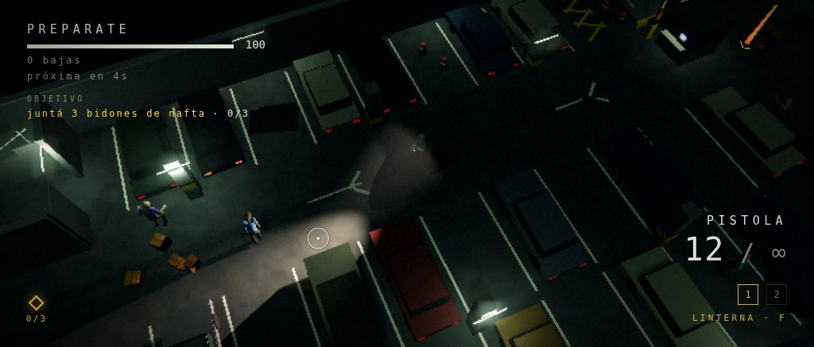
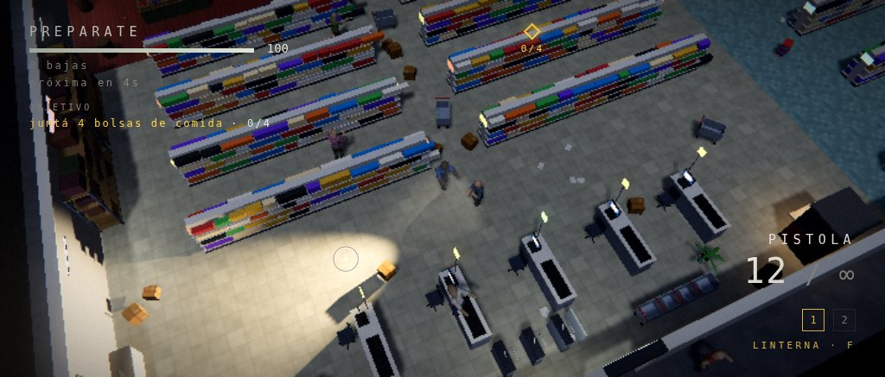
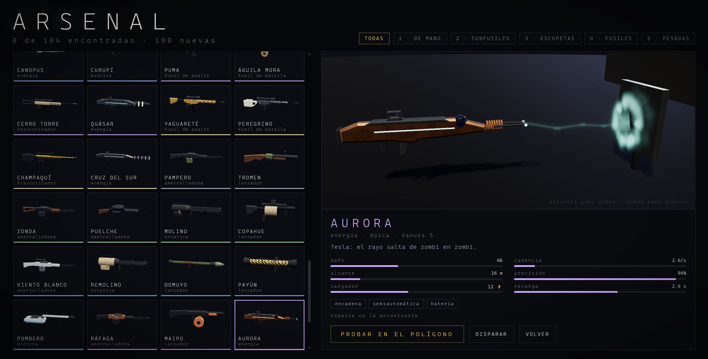
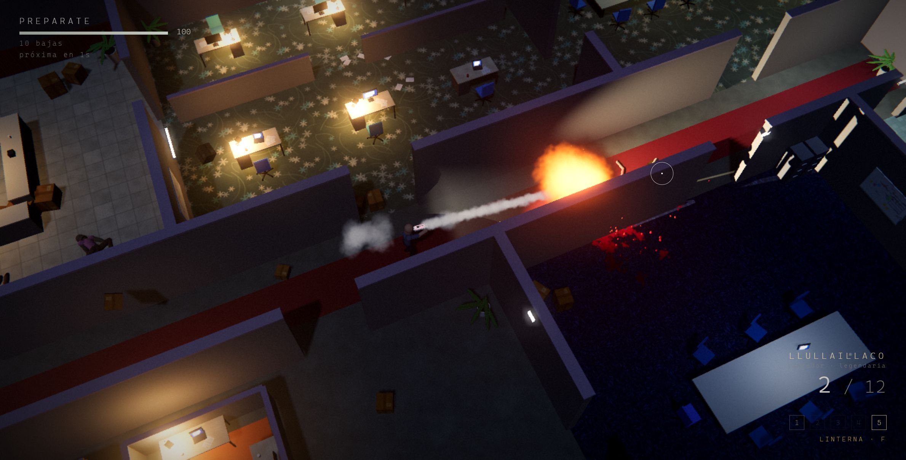
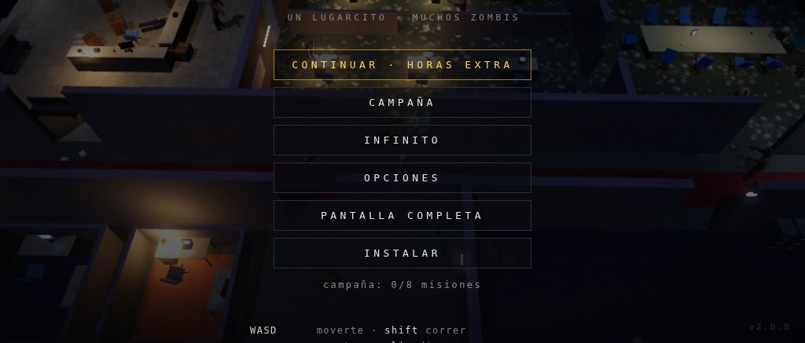
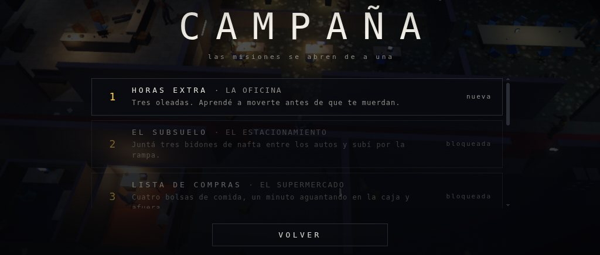
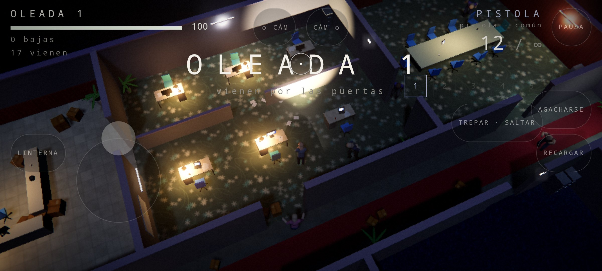

<div align="center">

# CARRONA

**Zombis top-down de noche en cinco lugares. Todos los cuerpos son ragdoll activo, todo el tiempo.**

Motor de física propio, músculos que son controladores PD, marcha por cinemática inversa y una
biblioteca de movimientos físicos: veinticinco maneras de levantarse, veintidós de caer, seis de
morir, trece de saltar, seis de trepar, veintiún sacudones por tiro, veinte ataques, once tics y
seiscientas combinaciones de estilo de marcha. Uno de cada cinco zombis pega saltitos; dos de
cada diez hacen parkour.
Cinco lugares (la oficina, el estacionamiento, el supermercado, la estación, el hospital), una
campaña de ocho misiones con progreso guardado, modo infinito, menú y opciones completas, en
castellano y en inglés. **Ciento cuatro armas** con modelo 3D y texturas propias, cada una con su
tiro: balas, rayos, rieles, relámpagos en cadena, cohetes que buscan, arpones que se clavan,
granadas, lanzallamas, frío, ácido, ondas y vórtices; una armería donde cada una dispara en vivo y
un polígono para probarlas. Un `index.html`, módulos ES, Three.js vendorizado. Cero dependencias
que instalar, cero archivos de textura o de sonido: todo es procedural. Para Windows hay
instalador y zip portable sin dependencias; en el navegador se instala como app.


</div>

## Qué es

Un shooter de oleadas y misiones visto desde arriba. La gracia no está en las armas sino en los cuerpos:
no hay ni un solo clip de animación en el proyecto. Cada zombi y el jugador son un esqueleto
de partículas que la física mueve, y lo único que cambia entre "camina", "corre", "se estrella
contra la pared" y "muere" es cuánta fuerza hace cada músculo para llegar a su pose. Un tiro
en el brazo apaga ese brazo. Un tiro en el pecho lo hace tambalear dos pasos hacia atrás y ahí
se queda. Un tiro en el hombro lo hace girar. Una escopeta de frente lo sienta de espaldas; por
la espalda, lo tira de boca. Un corredor que pega contra un escritorio queda colgado de él,
y después se levanta: rodando y empujando con los brazos, o de un salto si tiene apuro.

<div align="center">

|  |  |
|:--:|:--:|
| linterna, sangre y cuerpos que caen con su inercia | estampida de corredores por una puerta |

</div>

## Jugar

Hay cuatro caminos; en los tres de Windows el juego corre en `http://localhost:8765/` (los
módulos ES no cargan desde `file://`, por eso siempre hay un servidor local atrás; los récords y
ajustes viven en el `localStorage` de ese origen).

**1. Instalador (Windows 10/11, sin Python ni nada).** Bajá `CARRONA-Setup-x.y.z.exe` de
[Releases](../../releases), ejecutalo y listo: instala por usuario (sin pedir administrador) en
`%LOCALAPPDATA%\Programs\CARRONA` y deja un acceso directo **CARRONA** en el menú Inicio y, si
querés, en el escritorio. El acceso directo levanta un servidor local y abre el juego en una
ventana propia (modo app de Edge o Chrome). Windows va a mostrar el aviso de SmartScreen porque
el instalador no está firmado: *Más información → Ejecutar de todas formas*.

**2. Zip portable.** Bajá `CARRONA-portable-x.y.z.zip`, extraelo donde quieras y hacé doble clic
en **`Jugar CARRONA.bat`**. Tampoco necesita nada instalado. Si al extraerlo Windows marcó los
archivos como bajados de internet (Mark-of-the-Web), el `.bat` puede mostrar un aviso de
SmartScreen: *Más información → Ejecutar de todas formas*; o, antes de extraer, botón derecho
sobre el zip → *Propiedades* → *Desbloquear*.

**3. Desde el código.** Con Python 3: `npm run serve` o `python serve.py` y abrí
`http://localhost:8765/` (`python serve.py 8766 --no-open --dir dist` para otro puerto, sin
abrir el navegador, o sirviendo otra carpeta). También podés usar el lanzador de Windows desde
el repo: `Jugar CARRONA.bat`.

**4. Android (APK).** Bajá el `.apk` de [Releases](../../releases) al teléfono, abrilo e
instalalo (la primera vez Android pide permitir instalar desde esa app). Es el mismo juego
envuelto en una app nativa: pantalla completa apaisada, dos sticks flotantes (el dedo izquierdo
mueve, el derecho apunta y empujándolo dispara) y botones para lo demás; el botón ATRÁS pausa.
Los controles táctiles están en *Menú y opciones*; cómo se arma el APK, en *Android*.

### Instalar como app (PWA)

Cuando el navegador ofrece instalar el juego, en el menú aparece un botón **INSTALAR**. Lo
ofrece sólo si el juego está servido desde el build (`dist/`, el instalador o el zip): ahí
`index.html` trae una marca de versión y se registra el *service worker*, que precachea todos
los archivos del juego. Instalado, CARRONA queda en el menú Inicio como cualquier app, abre
en su propia ventana y **corre sin servidor** hasta que borres los datos del sitio en el
navegador. Cada versión nueva del build reemplaza la caché completa y borra la anterior.
Desde el repo (`serve.py`) el service worker no se registra nunca, así el código de desarrollo
no queda cacheado.

### Cómo funciona el lanzador

`launcher/carrona.ps1` es un script de PowerShell 5.1 (el que viene con Windows 10/11; no
necesita PowerShell 7) que:

1. Pregunta `http://localhost:8765/__carrona`: si ya hay un CARRONA sirviendo (otro doble clic,
   o `serve.py` de desarrollo), sólo abre el navegador y termina.
2. Levanta `System.Net.HttpListener` en `http://localhost:8765/` y sirve la carpeta del juego
   con los MIME correctos (`text/javascript` para los módulos, `application/manifest+json`
   para el manifest), sin salir nunca de esa carpeta. Si el puerto está ocupado prueba
   8766 a 8775 (ojo: en otro puerto los récords guardados no se ven, son por origen).
3. Busca Edge o Chrome en el registro (*App Paths*) y lo abre en modo app
   (`--app=`, sin barra de direcciones) con un perfil propio en `%LOCALAPPDATA%\CARRONA\profile`.
   Sin ese perfil el navegador delega en la instancia ya abierta y no hay manera de saber
   cuándo se cerró la ventana.
4. Cuando la ventana se cierra, apaga el servidor y termina. Si no hay Edge ni Chrome, abre el
   navegador predeterminado en una pestaña y apaga el servidor cuando el juego avisa que se
   cerró (`/__bye`) o cuando pasan 90 s sin pedidos.

`Jugar CARRONA.bat` y los accesos directos del instalador lo invocan con
`powershell.exe -NoProfile -ExecutionPolicy Bypass -WindowStyle Hidden -File`, así no depende
de la política de ejecución del equipo. Registra lo que hace en
`%LOCALAPPDATA%\CARRONA\launcher.log`.

Limitaciones conocidas:

- **Puerto ocupado**: si 8765 lo usa otro programa, cae a 8766..8775 y los datos guardados
  quedan en otro origen (se ven como récords en cero hasta que se libere el puerto).
- **Directiva de grupo de PowerShell**: `-ExecutionPolicy Bypass` no puede saltarse una
  política impuesta por GPO (`MachinePolicy`/`UserPolicy`). En ese caso queda el camino 3
  (`serve.py`).
- **Sin navegador Chromium**: Firefox u otro predeterminado abre el juego en una pestaña
  común, no en ventana app.
- **SmartScreen**: ni el instalador ni el `.bat` están firmados; la primera vez Windows pide
  confirmación.
- Al arrancar, la ventana negra de la consola aparece un instante: es `powershell.exe`
  arrancando antes de ocultarse.

## El juego

### Los lugares

Cinco lugarcitos, cada uno una losa que flota en la negrura con un pedazo de edificio encima,
armados con el mismo DSL (`src/game/level.js`) y registrados en `src/game/maps.js` con su
semilla, su grilla de navegación, su clima (paleta, luna, bloom, niebla) y sus textos.

| Lugar | Qué hay | Puertas |
|---|---|---|
| **La oficina** | hall, oficina abierta, dos salas de reuniones, pasillo, cubículos, cocina | oeste, norte, sur, este |
| **El estacionamiento** | subsuelo con columnas, autos, cabina de cobro, barreras, charcos, rampa, sala de máquinas; tubos verdosos que parpadean y niebla | rampa, escalera, montacargas, sur |
| **El supermercado** | góndolas en filas, heladeras con luz, cajas registradoras, frutas y verduras, depósito con estanterías, cartel de OFERTA | entrada, depósito, carga, este |
| **La estación** | andén largo con vías y un vagón detenido (la salida es su puerta), molinetes, boletería, columnas de azulejo, bancos, kioscos; luces de sodio y niebla | dos túneles, escalera, boletería |
| **El hospital** | pasillo central, habitaciones con camas y cortinas, monitores, guardia, camillas, quirófano, sala de espera con expendedora; luces frías que parpadean y una roja de emergencia | guardia, ambulancias, ascensor, terapia |

<div align="center">

|  |  |
|:--:|:--:|
| el estacionamiento: bidones entre los autos | el supermercado: la lista de compras |

</div>

Cada mapa tiene puntos con nombre (`L.point`): la salida y entre cuatro y seis lugares donde
las misiones dejan las cosas para juntar. Cambiar de mapa tira abajo el anterior por completo
(mallas, luces, estáticos, cuerpos, grilla y horda) y arma el nuevo; el menú queda sobre el
último lugar jugado, con zombis paseando.

### Campaña y modo infinito

Cinco lugares y ocho misiones en orden: cada una se abre al cumplir la anterior, y el progreso
(cumplidas, intentos, mejor tiempo, récords del infinito) queda guardado en el navegador.

| # | Misión | Lugar | Qué hay que hacer |
|---|---|---|---|
| 1 | Horas extra | la oficina | sobrevivir 3 oleadas |
| 2 | El subsuelo | el estacionamiento | juntar 3 bidones de nafta entre los autos y subir por la rampa |
| 3 | Lista de compras | el supermercado | juntar 4 bolsas de comida, aguantar un minuto y salir |
| 4 | Último tren | la estación | 4 oleadas pesadas (brutos desde la segunda) y subirse al vagón |
| 5 | Turno noche | el hospital | 60 bajas, 3 cajas de remedios y salir por la guardia |
| 6 | De vuelta a la oficina | la oficina | 5 oleadas pesadas con escopeta y fusil desde el arranque |
| 7 | La estampida | el estacionamiento | 3 minutos de estampidas por todas las puertas y la rampa |
| 8 | El fin del viaje | la estación | 6 oleadas, 30 bajas más y el último vagón |

Los objetivos son de cinco tipos y van en orden: sobrevivir N oleadas, matar N, aguantar T
segundos, juntar N cosas repartidas por el mapa (aparecen con una columna de luz y un marcador
en el HUD que apunta a la más cercana) y llegar a un punto (un faro en el mundo y el marcador
con la distancia). Cada mapa trae su configuración de oleadas: la clásica, una liviana para las
misiones donde lo importante es moverse, y una pesada con brutos desde la segunda oleada y
estampidas seguidas. El **modo infinito** son las oleadas sin fin de siempre, en cualquier lugar
donde ya hayas cumplido una misión (la oficina está abierta desde el principio); guarda la mejor
oleada y las bajas por mapa.

### El arsenal

<div align="center">

|  |  |
|:--:|:--:|
| la armería: cada arma dispara en vivo contra un blanco de acero | el polígono: micro cohetes que buscan |

</div>

Ciento cuatro armas: las cuatro clásicas de siempre (pistola, subfusil, escopeta y fusil, con sus
números intactos) y cien nuevas con nombre de cerro, viento, estrella, bicho o leyenda: HALCÓN,
JEJÉN, YAGUARETÉ, CERRO TORRE, PAMPERO, ZONDA, CRUZ DEL SUR, AURORA, CURUPÍ, LUZ MALA, POMBERO,
MANDINGA, HURACÁN. Catorce familias repartidas en cinco ranuras (de mano, subfusiles, escopetas,
fusiles y pesadas) y cinco rarezas, cada una con su color en el cartel, el HUD y la armería.

| Tiro | Qué hace |
|---|---|
| **bala** | hitscan contra huesos: perdigones, perforación, rebote en las paredes, balas explosivas, silenciador, robo de vida |
| **rayo** | láser continuo o de pulsos, perfora, con batería que se recarga sola (y se recalienta si se abusa) |
| **riel** | carga y atraviesa todo lo que tenga en la línea, con una hélice de luz |
| **relámpago** | busca al zombi más cercano en un cono y salta de uno a otro, sacudiéndolos |
| **proyectil** | con física: cohetes que aceleran, micro cohetes que buscan, granadas que rebotan, racimo, bombas pegajosas, virotes y arpones que se clavan, discos que rebotan en las paredes, bengalas, clavos, esferas de plasma, ácido, vórtices que chupan todo |
| **chorro** | fuego o frío en cono; la pared lo corta |
| **onda** | sónica: empuja y tumba |

Lo que queda después del tiro: **fuego** (daño por segundo, el cuerpo se carboniza), **frío** (lo
frena; lleno, lo congela y el próximo tiro lo quiebra con 50 % más), **choque** (se sacude y pierde
el control) y **ácido** (daño por segundo y 25 % más de todo lo demás). El fuego apaga el frío.
Los proyectiles saben cómo apuntar: las granadas, el ácido, las pegajosas y los vórtices caen en
parábola donde está el mouse; los arpones, virotes, bengalas y cohetes van derecho a la altura
del torso, con la gravedad compensada (un arpón apuntado al primero de una fila atraviesa a dos
y se clava en el tercero).

Arrancás con las cinco ranuras llenas: tu **equipo**, que armás en el ARSENAL con EQUIPAR (una
por ranura, de las 104; también desde la pausa, y ahí cambia en la mano al instante). Entre
oleadas siguen cayendo las clásicas si no las llevás, y además una del arsenal sorteada por
rareza (las raras pesan más a medida que avanzan las oleadas); los brutos sueltan armas y, muy
de vez en cuando, un zombi común también. Cada arma
va a su ranura: si está libre se levanta sola; si está ocupada aparece un cartel y **G** la
cambia (la tuya queda en el piso con las balas que tenía). La colección se guarda: la armería
muestra cuántas encontraste.

La **armería** (ARSENAL en el menú) tiene las 104 en miniaturas 3D que se pintan de a poco, filtros
por ranura, estadísticas y rasgos, y una vista previa en vivo donde el arma elegida dispara contra
un blanco de acero con la misma balística del juego (se gira arrastrando y se acerca con la
rueda). **Probar en el polígono** la lleva a la oficina con una horda liviana: la práctica no
cuenta para ningún récord.

### Menú y opciones

<div align="center">

|  |  |
|:--:|:--:|
| el menú sobre el último lugar jugado | la campaña: las misiones se abren de a una |

</div>

El menú es de botones: CONTINUAR (la próxima misión pendiente), CAMPAÑA, INFINITO, ARSENAL,
OPCIONES, PANTALLA COMPLETA y, cuando el navegador lo ofrece, INSTALAR. Un clic sobre una pantalla nunca
llega al juego: no hay forma de arrancar una partida sin querer. Esc cierra la pantalla que esté
arriba. Al morir: reintentar o volver al menú; al cumplir una misión: la siguiente, repetir o el
menú. La pausa congela la simulación y el audio, y también se pausa sola si la pestaña se va atrás;
desde la pausa se abre el ARSENAL para cambiar el equipo sin salir de la partida.

Las opciones se generan desde un registro declarativo (`src/game/options.js`): cada opción se
describe una vez (clave, grupo, tipo, rango, valor por defecto, cómo se aplica) y de ahí salen la
pantalla, la validación de lo guardado y la persistencia en `carrona.settings`.

| Grupo | Opciones |
|---|---|
| video | pantalla completa, calidad (minimo / movil / bajo / medio / alto), bajar la calidad sola si no llega a 45 fps (primero la resolución, después el preset), sombras, bloom, mostrar fps |
| audio | volumen general, efectos, ambiente y música (tres buses de Web Audio) |
| juego | sacudida de cámara, distancia e inclinación de cámara, adelanto hacia el mouse, idioma (castellano / inglés) |
| controles | controles táctiles (auto / sí / no), disparo táctil (empujando el stick / botón FUEGO), ayuda de puntería, tamaño y opacidad de los controles, zurdo, vibración; todas las acciones con teclas configurables (clic en la tecla, apretar la nueva; esc cancela), teclas por defecto |

Los textos viven en `src/core/i18n.js` en los dos idiomas; el idioma cambia en caliente, sin
recargar.

| Tecla (por defecto) | Acción |
|---|---|
| WASD / flechas | moverse (relativo a la cámara) |
| Shift | correr (el arma baja, el cuerpo se inclina al arrancar) |
| C / Ctrl | agacharse. C tocada mientras corrés: **rodada de esquive** |
| mouse | apuntar. Click dispara (mantener en las automáticas) |
| R | recargar |
| 1 a 5 | sacar lo que haya en cada ranura (de mano, subfusiles, escopetas, fusiles, pesadas) |
| G | agarrar el arma del piso cuando su ranura está ocupada (la tuya queda en el piso) |
| Espacio | trepar lo que tenga adelante; corriendo sin nada adelante, **saltar**; si no, empujón. En el piso: levantarse ya |
| Q / E | girar la cámara 45° |
| rueda | acercar o alejar la cámara |
| F | linterna |
| Esc | pausa |
| F3 | panel de rendimiento |

Con el dedo (teléfono, tablet o la app de Android: se prenden solos cuando el puntero principal
es grueso; en un portátil con pantalla táctil manda el mouse, salvo que se fuercen en opciones):

| Gesto | Acción |
|---|---|
| dedo izquierdo, donde sea de la mitad izquierda | **stick de movimiento**: aparece donde apoyás, se mueve relativo a la cámara y **sigue al dedo** (pasado el borde, el origen se arrastra detrás: cambiar de dirección es inmediato). La velocidad es una sola curva continua de la zona muerta al fondo: hasta el 70 % del recorrido crece hasta caminar (3,6 m/s), de ahí al fondo pasa suave a correr (5,6 m/s); la postura de correr (arma abajo, esquive, salto) entra al 85 % con histéresis |
| dedo derecho, mitad derecha | **stick de puntería**: apunta a 6 m en esa dirección y **empujándolo más de la mitad dispara** (al soltarlo deja de disparar; las semiautomáticas repiten solas a su cadencia mientras esté empujado). La ayuda de puntería imanta al zombi más cercano dentro de un cono de 11° hasta 14 m |
| FUEGO | botón de disparo aparte, si en opciones elegís *disparo táctil: botón* (el stick derecho sólo apunta) |
| RECARGAR · TREPAR · AGACHARSE · LINTERNA | los botones de los costados. AGACHARSE se mantiene; tocado corriendo, rodada |
| ⟲ ⟳ | girar la cámara 45° |
| AGARRAR | aparece con el nombre del arma del piso cuando su ranura está ocupada |
| ranuras del HUD | tocar una saca esa arma |
| II | pausa (en la app, también el botón ATRÁS del sistema) |
| vibración | un pulso corto por tiro (con techo de frecuencia: una automática no satura el motor), uno más largo al recibir un golpe, uno al agarrar algo. Se apaga en opciones |
| zurdo | en opciones: la mitad derecha mueve, la izquierda apunta, y los botones se espejan |

Con el stick activo, un hilo tenue une al jugador con la mira: en una pantalla chica se ve a
dónde se apunta sin buscar la cruz.

Los sticks son flotantes a propósito: nunca hay que mirar dónde están. Cada dedo se sigue por
su `pointerId`, así los dos sticks y un botón conviven sin mezclarse; y si la app se va al fondo
con un dedo apoyado, se sueltan todos (nadie vuelve a una partida con el personaje caminando solo).
La matemática (zona muerta, saturación, histéresis, ejes de cámara, ayuda de puntería) está en
`src/core/sticks.js`, sin DOM, y `test/t_touch.mjs` la prueba.

Armas: **las 104 están disponibles desde la primera misión**. Salís con las cinco ranuras
llenas con tu EQUIPO, que se arma en el ARSENAL con el botón EQUIPAR (también desde la pausa,
y ahí el arma cambia en la mano al instante); por defecto, la pistola (munición infinita), el
subfusil, la escopeta, el fusil (atraviesa un cuerpo) y la pesada común. Entre oleadas siguen
cayendo armas sorteadas por rareza para cambiar sobre la marcha (ver *El arsenal*). La cabeza
recibe daño ×4. Los miembros se cortan con daño acumulado y sin una pierna
el zombi se arrastra. Entre oleadas caen munición, botiquines y armas.

El jugador es **ágil**: contra una pared a toda velocidad atrapa con las manos y rebota (no se
desarma), se lleva puesto a un zombi con el hombro sin caerse, y tirado en el piso no espera:
apretando una dirección rueda de costado o gatea hacia allá y se levanta en la carrera.

## Instalador y distribución

### Build y release

```
node tools/icons.mjs        # regenera icons/ (PNG 192/512/32, maskable y carrona.ico), determinista
node tools/build.mjs        # arma dist/: juego + lanzador + íconos + manifest, inyecta la meta de
                            # versión en index.html, genera sw.js con el precache, escribe
                            # installer/version.iss y el zip CARRONA-portable-x.y.z.zip
node test/t_build.mjs       # prueba el build (precache exacto, zip, lanzador, íconos, serve.py)
```

El instalador se compila con [Inno Setup 6](https://jrsoftware.org/isinfo.php):
`ISCC.exe installer\carrona.iss` deja `dist\CARRONA-Setup-x.y.z.exe`. La versión sale de
`package.json` (`src/core/version.js` tiene que coincidir, `t_build` lo verifica).

Para publicar: subí la versión en `package.json` y `src/core/version.js`, y pusheá un tag
`vX.Y.Z`. El workflow `.github/workflows/release.yml` corre en `windows-latest`: genera los
íconos, corre las pruebas y el build, compila el instalador con el Inno Setup que trae el
runner y crea el release de GitHub con el `.exe`, el zip y el `.apk` adjuntos. Se puede lanzar a
mano (*workflow_dispatch*) para probar sin publicar: deja los archivos como artefactos.

### Android

<div align="center">



*el polígono en el teléfono: stick de movimiento flotante, botones, el HUD compacto*

</div>

`mobile/` es el envoltorio nativo: [Capacitor 6](https://capacitorjs.com) con un solo proyecto
(`mobile/android`), sin plugins. El juego no cambia: `tools/build.mjs --android` arma
`dist-android/www` (index.html, src, vendor, íconos, manifest y LICENSE, con una meta
`carrona-platform`; sin lanzador, sin `.bat` y sin service worker, porque el WebView sirve los
archivos desde la app y no hay nada que cachear), `cap sync` lo copia adentro del proyecto y
Gradle arma el APK. `tools/apk.mjs` hace todo eso de una:

```
npm ci --prefix mobile               # una vez: Capacitor y el generador de íconos (el juego no tiene dependencias)
node tools/apk.mjs                   # build web → cap sync → assembleDebug → dist-android/CARRONA-x.y.z-debug.apk
node tools/apk.mjs --install --run   # además lo instala y lo abre en el teléfono o emulador conectado (adb)
node tools/apk.mjs --release         # firmado si existe mobile/android/keystore.properties; si no, sin firmar
```

Hace falta un JDK 17 o más nuevo y el SDK de Android (`ANDROID_HOME`, o el de Android Studio en
`%LOCALAPPDATA%\Android\Sdk`; `apk.mjs` escribe `local.properties` si no está). La versión y el
`versionCode` de la app salen del `package.json` de la raíz: no hay dos lugares que actualizar.

Lo que hace la app además de mostrar el juego (`MainActivity.java`, sesenta líneas):

- **Pantalla completa inmersiva** (las barras del sistema se esconden; un gesto desde el borde
  las asoma un momento) y **apaisado** (`sensorLandscape`: gira con el teléfono, nunca vertical).
- **La pantalla no se apaga** mientras el juego está adelante (`FLAG_KEEP_SCREEN_ON`).
- **El botón ATRÁS va al juego**: `carrona.backButton()` cierra lo que esté arriba (pausa
  jugando, sigue en pausa, cierra opciones, vuelve del arsenal); en el menú principal la app se
  va al fondo (`moveTaskToBack`) en vez de morir, así al volver la partida sigue donde estaba.
- El origen es `https://localhost` (el esquema de Capacitor): los ajustes y el progreso viven en
  el `localStorage` de ese origen y sobreviven a cerrar la app.
- Permiso `VIBRATE`: sin él el WebView ignora `navigator.vibrate` y la vibración táctil no anda.
- `targetSdk 35` a propósito: desde 36 Android activa el «atrás predictivo» por defecto y deja
  de llamar a `onBackPressed`; cuando se suba hay que pasar el manejo a `OnBackPressedCallback`.

El juego sabe que está en la app por `Capacitor.isNativePlatform()` (`src/core/pwa.js`): esconde
INSTALAR y PANTALLA COMPLETA, prende los controles táctiles y, la primera vez, arranca en calidad
**movil** (ver *Render*). La app y el navegador comparten exactamente el mismo código: en un
teléfono el juego servido desde la web se ve y se juega igual, controles incluidos.

En CI (`release.yml`) el APK se arma en `ubuntu-latest` con JDK 17 y viaja al release junto con
el instalador y el zip. Si el repo tiene los secrets `ANDROID_KEYSTORE_B64` (el `.jks` en
base64), `ANDROID_KEYSTORE_PASSWORD`, `ANDROID_KEY_ALIAS` y `ANDROID_KEY_PASSWORD`, sale firmado
como `CARRONA-x.y.z.apk`; si no, sale `CARRONA-x.y.z-debug.apk` (firma de debug: se instala
igual, pero una versión nueva no actualiza una instalada con otra firma).

#### Google Play

Todo lo que pide la ficha está en `store/`: los textos en castellano e inglés (`es-AR/`, `en-US/`,
dentro de los límites de 30 / 80 / 4000 caracteres), el ícono de 512, el gráfico destacado de
1024×500, ocho capturas de teléfono de 1920×1080 (Play exige lado largo / lado corto ≤ 2), la
política de privacidad (`PRIVACY.md`: el juego no recopila nada) y **`PUBLICAR.md`**, el paso a
paso completo de Play Console con las respuestas de cada formulario (clasificación de contenido,
seguridad de los datos, público objetivo, firma de apps). El arte se regenera con
`node tools/store_shots.mjs` (Chrome emulando un teléfono de 1920×1080, con el juego servido en
`localhost:8767`) y `python tools/store_art.py` (ícono, gráfico destacado, capturas a 24 bits).
`node tools/apk.mjs --aab` arma el Android App Bundle firmado con
`mobile/android/keystore.properties` y muestra la huella SHA-256 del certificado, y
`tools/play.mjs` sube ficha e imágenes y publica el AAB en una pista por la API oficial
(`--listing --images`, `--upload <aab> --track internal|production`, `--dry-run`, `--selftest`)
con una cuenta de servicio de la consola. `t_build` verifica las medidas del arte, los límites de
los textos y que ninguna clave esté en git.

## El core

Veinte mil líneas de JavaScript sin framework. Estas son las piezas y por qué son así.

### 1. Motor de física XPBD (`src/phys/world.js`)

Position Based Dynamics extendido, escrito desde cero para este juego.

- **Partículas en arreglos planos** (`px, py, pz, vx, vy, vz, invMass, flags`), nada de objetos
  por partícula. Un solo `Float32Array` por atributo, así el bucle caliente no persigue punteros.
- **Substepping**: 7 substeps por cuadro a 60 Hz, o sea 420 Hz de física. Las restricciones se
  resuelven una vez por substep en vez de iterar muchas veces por cuadro; es la variante que
  mejor conserva la rigidez sin que la energía explote.
- **Restricciones de distancia con compliance** (la "X" de XPBD): huesos casi rígidos, límites de
  rango mínimo y máximo para codos y rodillas, y restricciones blandas para el torso.
- **Colisión**: partículas contra piso, cajas orientadas y cilindros, con hash espacial de celda
  0.55 m para las partículas entre sí. Además **los huesos chocan como cápsulas**, no sólo sus
  puntas: contra el mundo (un cuerpo puede quedar colgado del borde de un escritorio) y contra
  partículas ajenas (una pierna patea una caja, un brazo se apoya en otro torso).
- **Ganancia por dueño**: cada partícula sabe de qué cuerpo es. Un cuerpo sin músculo no puede
  empujar a uno con músculo más de un 10 % por substep, y hay un tope de 9 m/s para cuerpos
  sin control. Sin eso una estampida funcionaba de topadora y mandaba cuerpos a 60 metros.
- **Expulsión limitada**: la corrección de penetración se acota al movimiento real del substep,
  así una superposición grande se resuelve en varios pasos y no como un disparo.
- **Raycast contra estáticos** para la puntería y para la raíz de los cuerpos, y `compact()`
  para reciclar partículas de cuerpos que ya no existen.

Costo medido con la CPU libre: 40 ragdolls más 40 cajas y 12 cilindros en 9 ms por cuadro;
916 partículas con 3250 restricciones en 11 ms.

### 2. Ragdoll activo (`src/phys/ragdoll.js`)

Un humanoide de **16 partículas y 15 huesos** (cabeza, cuello, pecho, hombros, codos, manos,
cadera, rodillas, pies) con una pose de referencia en metros (`skeleton.js`). Sobre esa base:

**Músculos como controlador PD, no como resorte.** Cada partícula tiene un objetivo (su lugar en
la pose, ya orientado y desplazado con la raíz). En cada substep el músculo tira la posición
hacia el objetivo (término proporcional) y después fusiona la velocidad de la partícula con la
velocidad del cuerpo (término derivativo), con **amortiguación crítica**:

```
a = (1 - phys) · min(1, max(0, (m - 0.02) · 14)) · min(1, 1.45 · sqrt(kSub · m))
```

`m` es la fuerza del músculo de esa partícula, `kSub` la ganancia de posición del substep. Con
amortiguación infinita el cuerpo llegaba exacto a su pose y parecía un maniquí; con menos que
crítica oscilaba a 18 rad/s alrededor de la pose aun al 1 % de fuerza y cada empujón rebotaba.
Con esto el torso queda firme y la cabeza y los brazos llegan con un retraso y un pequeño
sobrepaso, que es lo que se lee como movimiento secundario. Cayendo o muriendo la
amortiguación se apaga del todo: la inercia manda.

**Raíz virtual con correa.** El cuerpo no se mueve empujando partículas: se mueve un punto
invisible (la raíz) al que la pose está anclada, y los músculos lo siguen. La raíz avanza por
substep (no por cuadro, para que no haya dientes de sierra), nunca cruza una pared (raycast
antes de cada paso), no entra en otro cuerpo de pie (resbala tangencialmente a su alrededor y
los dos se dan un topetazo) y tiene una correa: si el cuerpo se queda atrás más de cierto largo,
la raíz espera. Cayendo, la pose se ancla al **centro de masa** del cuerpo real: el músculo da
forma a los miembros sin empujar al conjunto, y el momento que traía se conserva.

**Velocidad con inercia.** La velocidad pedida por la IA o el jugador se rampa a 9 m/s² al
acelerar y 14 al frenar. Arrancar y parar toman tiempo y el cuerpo se **inclina al esfuerzo**:
la diferencia entre la velocidad que quiere y la que tiene se convierte en una inclinación del
torso, adelante al arrancar, atrás al frenar. En las **curvas se inclina hacia adentro** (más
cuanto más rápido), la cabeza **anticipa el giro** mirando adonde quiere ir antes de que el
cuerpo llegue, y al **pivotar en el lugar** los pies dan pasitos laterales en vez de patinar.

**Marcha por cinemática inversa.** No hay ciclo de caminata grabado. Cada pie sigue una
trayectoria: apoyo lineal a la velocidad del cuerpo y vuelo en arco, con zancada proporcional a
la velocidad y en la dirección del movimiento (el jugador da pasos laterales mientras apunta a
otro lado; un tiro hace dar pasos hacia atrás). La rodilla se resuelve con IK de dos huesos
usando el largo real de muslo y pantorrilla, doblando siempre hacia adelante. Caminar, trotar y
correr son la misma marcha mezclada por velocidad: rodilla mínima de 125°, 103° y 89°, pie que
sube 16, 26 y 34 cm. Los codos también salen por IK, y el estilo de brazos de caminar y el de
correr se **mezclan en continuo** (un cambio seco tiraba las manos casi un metro en un cuadro).

**Pies plantados, con peso.** La fase de la marcha avanza con lo que avanza la raíz (no con el
tiempo, ni con un piso de cadencia), la zancada de la pose y la de la cadencia son la misma
(estilo incluido) y la pierna que renguea da un paso más corto acortando su apoyo, no yendo más
despacio: por construcción el pie apoyado se mueve hacia atrás exactamente a la velocidad del
piso. Encima, mientras un pie está en apoyo su objetivo se **congela en el mundo** donde tocó el
piso (la raíz avanza por substep y el objetivo local se calcula por cuadro: sin esto el pie se
iba 6 cm adelante y volvía de un salto), la rodilla se resuelve para el pie que está plantado y
no para el de la trayectoria, y se suelta recién cuando la pierna casi recta ya no llega (una
sola vez por zancada, fundiendo el objetivo en un décimo de segundo). El vuelo del pie es una
curva de Hermite que **llega al piso ya retrocediendo** (el pie "rasca" al aterrizar, como un
corredor) en vez de llegar parado respecto del cuerpo. Corriendo aparece la **fase de vuelo**
(apoyo del 64 % del ciclo) y la **pelvis baja** lo que la pierna de apoyo alcanza: las rodillas
quedan siempre algo flexionadas, la cadera sube y baja con la zancada y el pie toca el piso en
cada paso (antes flotaba un centímetro colgado de los músculos). Patinaje del pie apoyado, medido:
0,2 m/s caminando y 0,3 corriendo (era 0,6 y 0,8).

**Límites articulares de verdad.** Las partículas no tienen ángulos, pero la dirección de cada
segmento respecto del marco del torso sí se acota, por substep y de a poco (2 cm, la mitad de
la corrección, para que converja sin pelear). Rodillas y codos son **bisagras con cono**: la
articulación sólo puede salirse de la línea cadera–pie hacia un cono de 65° (80° el codo)
alrededor de la flexión nominal, así la rodilla no dobla al revés ni queda 30 cm de costado como
un palo quebrado; sin músculo el cono se abre casi del todo (las rodillas de un cadáver caen de
costado) y la cadera se relaja hacia afuera (las piernas "en carpa" de un muerto boca arriba se
van cayendo solas). **Conos de cadera, hombro y cuello**: el muslo hasta 45° hacia atrás, 50°
abierto, 20° cruzado y la rodilla no sube más de 30° sobre la cadera; el brazo hasta 48° detrás
del plano del pecho y 27° cruzado; la cabeza 50° y el cuello 35° respecto del tronco, con un
tope mínimo cabeza–pecho para que el cuello doble hasta 64° y no se pliegue dentro del tórax.
**Autocolisión mínima**: manos y codos son esferas contra la cápsula pecho–cadera y contra la
cabeza (en una caída de boca las manos pasaban por el medio del pecho). Y **los huesos tienen la
última palabra**: al cerrar cada substep, después de contactos y límites, una pasada rígida sobre
los quince huesos y las riostras del torso (dos barridos al cerrar el cuadro) deja el esqueleto
del largo exacto; la pose objetivo también se relaja a los largos reales antes de usarse, así el
músculo nunca pide un hueso estirado. Estiramiento máximo, medido: 2 % de pie, 8 % en un flinch
de pistola (era 37 %), 26 % en una multitud de doce que se aplasta (era 116 %).

**Balance por punto de captura** (lo que hace Euphoria). Cada cuadro se calcula dónde va a
estar el cuerpo dentro de un cuarto de segundo respecto de donde debería (la raíz): la posición
que se fue más allá de la correa más `τ · (velocidad del centro de masa − velocidad del centro
de masa de la pose objetivo)`, porque inclinarse al arrancar o la zancada mueven el centro de
masa a propósito y eso no es perder el equilibrio. Se descuenta frenarse contra algo (de eso se
ocupa el estrellarse), cambiar de idea da un tercio de segundo de gracia (el jugador que corta a
90° no se cae por cortar) y el error que decide se filtra en 50 ms: un empujón de verdad cambia
la velocidad del cuerpo y queda, un salto de un cuadro pasa sin dejar rastro. Con el error
pequeño los **brazos salen a equilibrar** en proporción (molinete hacia atrás y arriba si se va
para atrás, afuera y abajo a frenar si se va adelante) y el tronco se echa en contra; pasado un
umbral da **pasos de recuperación** hacia allá; pasado otro, cae con una caída elegida por la
dirección. Medido: veinte estilos de caminar, treinta de correr, arrancar y frenar, correr en
círculo, el jugador en zig-zag y retrocediendo, sin un solo tambaleo en falso; un empujón
sostenido de 60 cm da un paso de recuperación y queda de pie.

**Reflejos de caída** (Euphoria otra vez). Cayendo sin control, sobre la coreografía de la caída
se montan tres reflejos que duran medio segundo: las manos van al **punto de impacto previsto**
(adonde va el pecho con la velocidad que trae, el tiempo que tarda en llegar al piso), no adonde
mira; cayendo de espaldas el **mentón se recoge al pecho** para que la nuca no sea lo primero
que pega; y si la cabeza va a pegar (baja rápido y ya está cerca) la mano de ese lado se mete
**entre la cabeza y el piso**. Los reflejos son objetivos de pose con los brazos y el cuello
endurecidos dos veces y media (un brazo flojo no frena nada): así el brazo absorbe de verdad.
Medido: empujado de frente, las manos tocan el piso a los 0,52 s en vez de 0,68 y la cabeza llega
a 0,8 m/s en vez de 1,1. Y después de un tiro o un empujón, durante un segundo la cabeza **mira
de dónde vino**, por encima del hombro si hace falta (la amenaza manda sobre la mirada de la IA).

**Peso en la marcha.** La pelvis gira con la zancada (la cadera de la pierna que va adelante se
adelanta, hasta 8°), los hombros giran al revés (contra-rotación, 6°) y la cabeza sube y baja y
se mece la mitad que el pecho, como la de verdad: sin esto el tronco iba como un bloque sobre
las piernas.

**Rodillas nunca al revés.** Una violación grande de una bisagra o de un cono de cadera (la
rodilla 20 cm al revés aplastada por la multitud, la pierna abierta a 90° por el arrastre de un
cuerpo que desliza) se corrige fuerte y de una, pero **sin velocidad** (se mueve también la
posición anterior): como restricción, 7 cm en un substep metían 30 m/s en la rodilla y el cuerpo
explotaba. Sólo rodillas y caderas, y sólo con músculo (o mientras un cadáver desliza): en codos
y hombros peleaba con los reflejos de los brazos, que sí llevan velocidad, y en un cadáver quieto
convertía una rodilla al revés en una rodilla de costado. Medido: escopeta de costado a un
corredor, la rodilla al revés pasa del 37 % de los cuadros a menos del 10 %; en los saltos, del
24 % al 2 %.

**Deslizar con el impulso.** El piso tiene fricción **estática** (0,92: un pie plantado agarra, un
cuerpo que se desploma en el lugar no se desparrama) y **dinámica** (0,30) para el cuerpo que ya va
deslizando entero, rápido: un corredor muerto a 3,8 m/s recorre 2,5 m en total y resbala casi un
metro por el piso antes de parar, en vez de clavarse donde tocó; mientras desliza y medio segundo
después, las caderas se cierran con fuerza de vivo para que el arrastre no le abra las piernas.

**Cadáveres que se asientan.** Un cuerpo sin músculo (muerto, tirado) lleva una **viscosidad
hacia su propio campo rígido**: se calcula el movimiento de cuerpo rígido que mejor describe a
todas las partículas (centro de masa, momento angular, tensor de inercia) y cada velocidad se
funde un poco hacia ese campo, así se conservan el momento lineal y el angular (la caída sigue
volando con el impulso que traía) pero el temblor interno se apaga. Recién muerto queda medio
segundo de **tono residual** (cae como peso muerto, no como bolsa) y un pedazo cortado (la
cabeza que vuela) tiene su propio grupo: no lo frena el cuerpo. Medido: un cadáver está quieto
(< 1 cm/s) a los dos segundos y medio de morir y no vuelve a moverse en diez.

**Estilos de marcha** (`moves.js`): cada cuerpo sortea al nacer un estilo de caminar y uno de
correr, y los mezcla según la marcha. **Treinta de correr**: sprint, carga con los brazos
atrás, agitando los brazos, a zancadas, como un toro con la cabeza gacha, molinete, rengo,
agachado, pisando fuerte, a saltos, garras al frente, el clásico con los brazos tiesos,
**brazos sin músculo que cuelgan y se sacuden** (física pura), un brazo en alto, abrazándose,
las manos en la cabeza, gorila con los nudillos rozando el piso, gritando con la cabeza atrás,
brazos como alas hacia atrás, manos altas a agarrarte, atleta, brazos cruzados, medio de
costado, galope (las piernas fuera de contrafase), rebotando, en puntas de pie, arrastrando
los pies, borracho en zigzag, echado atrás, piernas tiesas. **Veinte de caminar**: arrastrando
los pies, arrastrando una pierna, tieso, encorvado, brazos extendidos, con tics, bamboleándose,
ladeado, tambaleante, rengo, gateando casi, con jaqueca, abrazado, garras, orgulloso, cangrejo,
delicado, elástico, arrastrando, aullando. Seiscientas combinaciones: una horda no se ve clonada.

**Máquina de estados y biblioteca de movimientos** (`moves.js`). Un movimiento es una
secuencia de poses objetivo generadas por funciones, con un perfil de músculo por miembro,
movimiento de raíz, giros de marco e impulsos puntuales. Los músculos tiran hacia esas poses y
la física hace el resto: por eso una levantada choca con el escritorio de al lado.

| Estado | Qué corre |
|---|---|
| de pie | la marcha con su estilo, más **overlays** que se suman sin interrumpirla: **veintiún sacudones** por tiro (la cabeza se va, latigazo, el pecho se pliega, la espalda se arquea, se dobla por el estómago, el hombro lo gira, el brazo vuela, la cadera se va o se tuerce, se ladea, la pierna da un saltito, las rodillas ceden, se agarra el brazo, la cara o la panza, convulsión, encogerse de hombros, brazos buscando el equilibrio, casi se desploma), **cinco heridas sostenidas** (una mano apretando la cabeza, la panza, el hombro o el muslo mientras sigue andando), **veinte ataques** y once tics de quieto |
| tambaleo | pasos reales en la dirección del golpe con latigazo del torso; la raíz se va con él y el cuerpo **queda desplazado**, no vuelve como una goma |
| saltando | agachada previa sin cortar la marcha, patada real a todas las partículas y la pose **anclada al arco balístico** (el controlador PD persigue la velocidad vertical del arco, así el cuerpo vuela de verdad y aterriza con impacto). **Trece figuras**: saltito, brinco, zancada, bollo, plancha, patada voladora, rodillazo volador, estrella, manoteando el aire, dejándose caer, valla, rebote en la pared, saltito de emoción. Al caer flexiona según la altura; el ágil rueda; el torpe se desploma |
| trepando / bajando | el ancla sube del piso a la tapa (o baja) con la curva del estilo. **Seis trepadas**: clásica (manos, rodilla, arriba), pasada rápida con una mano y las piernas cruzando de costado, kong (dos manos, cadera arriba, piernas entre los brazos), dash (las piernas primero, las manos atrás), de panza por encima, frenética a cuatro patas. Una valla baja a la carrera se salta sin manos; el de parkour se tira de cabeza por encima y rueda. A veces sale mal: se lleva el borde por delante y vuelca encima. **Bajar**: ve el borde medio metro antes y elige: paso a paso, sentarse y dejarse caer, saltito, salto, salto y rodada, o tropezar |
| movimiento | secuencias cortas que devuelven el control de pie: rodada hacia adelante, de hombro (parkour), hacia atrás, de costado por el piso, gateo rápido que se vuelve carrera, deslizada de béisbol, embestida con el hombro, agacharse de golpe, pasos tambaleantes |
| cayendo | una de **veintidós caídas** elegida por causa y ángulo: sentarse de espaldas, de tabla, de boca, de rodillas y de boca, de costado, girando, desplomarse, volando, voltereta (el corredor), rebote contra la pared, de cara contra la pared, girar y resbalar por la pared, desplomarse contra la pared, volcar sobre un borde, de cara sin manos, rueda de costado, helicóptero, resbalón, tres pasos y cae, de rodillas resbalando, plancha fallida, tacle |
| tirado | física pura, aturdido un tiempo que depende del tipo (el corredor 0.35 s, el bruto 1.3 s, el jugador 0.28 s) |
| levantándose | una de **veinticinco levantadas** elegida por cómo quedó. Boca arriba: abdominal, rodar y empujar, de un salto, pesada, rodar y gatear, voltereta hacia atrás, mareado y ladeado, el bruto que ruge. Boca abajo: flexión, rodilla primero, rodar y sentarse, gatear, rápida, explosiva desde la posición de salida, gatear y salir corriendo, la que falla a mitad y vuelve a intentar. De costado: a boca abajo, a boca arriba, sobre el codo, barrer las piernas. Desde arrodillado: normal, de un salto, lanzándose a correr. Desde sentado: normal, girando sobre una rodilla. El peso de cada una depende del tipo de cuerpo y del rasgo parkour |
| descansando | dormido en el piso o sentado contra la pared hasta que algo lo despierte; entonces se levanta como corresponda |
| muriendo | una de **seis muertes**: se desploma, camina herido y cae, cae de rodillas y de boca, se arquea de espaldas, gira y cae, se dobla y se va de costado. Un tiro en la cabeza es instantáneo |

**Reacción al disparo**, el patrón de "physical animation":

1. Impulso local en el punto del hueso donde pegó: el miembro se va y el torso gira si el
   tiro fue descentrado.
2. Un sacudón elegido por zona y ángulo (la tabla de arriba), encima de lo que estuviera haciendo.
3. Un tambaleo con pasos reales en la dirección del tiro; el objetivo de equilibrio se muda.
4. Un tiro en el hombro hace girar el cuerpo. Un tiro en la pierna corriendo lo tropieza (el
   corredor da la voltereta y sigue); parado, se le dobla la rodilla o se desploma si fue fuerte.
5. Mucho momento en poco tiempo (escopeta, ráfaga) lo tira, con una caída elegida por el ángulo.

**Colisiones a la carrera.** Contra una pared de frente, según quién: el ágil (el jugador, el
de parkour) **la atrapa con las manos**, rebota y tambalea hacia atrás sin caer; el de parkour
rápido planta un pie y **se impulsa hacia atrás y arriba** girando en el aire; el resto rebota y
cae, se estrella de cara, gira y resbala por la pared hasta sentarse, o se le doblan las
piernas contra ella. Contra el borde de un escritorio que no llegó a trepar: vuelca encima. De
refilón: raspa el hombro, gira y sigue tambaleando a lo largo de la pared. Contra otro cuerpo:
por la espalda, el de adelante cae de boca y el de atrás se tropieza con él; de frente, a más
velocidad los dos se van al piso; de costado, un hombrazo que hace girar al otro; el ágil se lo
lleva puesto con el hombro y sigue. Los pies que se traban en un cadáver o una caja tropiezan.

### 3. Navegación (`src/game/nav.js`)

El nivel se rasteriza a una grilla de 0.4 m con 0.30 m de margen y se calcula un **campo de
flujo** con Dijkstra desde el jugador. Cada zombi lee la dirección de su celda: cien cuerpos
cuestan lo mismo que uno. Los muebles con tapa por debajo de 1.05 m no cortan el camino, así que
el flujo pasa por encima de escritorios y mesas y los zombis los trepan en vez de rodearlos.

### 4. La horda (`src/game/zombie.js`, `src/game/game.js`)

Estilo Left 4 Dead: **todos corren** cuando te persiguen, cada uno a su manera.

| Tipo | Deambulando | Persiguiendo | Rasgo |
|---|---|---|---|
| caminante | 0.35 a 0.7 m/s | 2.6 a 3.3 m/s | arrastra los pies hasta que te ve |
| trotador | 0.45 a 0.85 m/s | 3.0 a 3.7 m/s | la mayoría de la horda desde la oleada 2 |
| corredor | 0.55 a 1.0 m/s | 3.7 a 4.6 m/s | liviano, se estrella contra todo, tacle |
| bruto | 0.35 a 0.55 m/s | 1.7 a 2.2 m/s | 1.8 de masa, resiste 2.6 veces más, mazazo que tumba |

Estados: dormido (deambula, o descansa sentado, arrodillado o tirado en el piso), alerta (te
vio, te oyó o le pegaste: se da vuelta, medio segundo de reacción, y arranca), persecución
(flujo lejos, directo cerca, separación entre cuerpos y flanqueo para rodearte), ataque.

**Rasgos.** Uno de cada cinco **pega saltitos**: brinca mientras corre con su figura propia
(brinco, zancada, patada, manoteando el aire), salta de emoción dos o tres veces al verte y se
mece sobre las rodillas cuando está quieto. Dos de cada diez hacen **parkour**: cruzan los
escritorios en kong o dash, o se tiran de cabeza por encima y ruedan; bajan saltando y ruedan
al caer; rebotan en las paredes con el pie; se lanzan en plancha desde tres metros; se levantan
con voltereta o de un salto; y se les nota la agilidad en todo lo demás.

Los vuelos son un **evento, no la regla**: de a uno por vez y con varios segundos de enfriamiento.
La mayoría te llega corriendo, y el corredor no frena cerca tuyo: si te corrés, te pasa de largo
manoteando y se estrella contra lo que haya atrás. La plancha que **te agarra** cae encima y te
tira; la que falla, el corredor la aterriza de pie, tambalea y sigue corriendo (el de parkour
rueda, el caminante cae de panza).

| Ataque | Quién | Qué hace |
|---|---|---|
| manotazo derecho o izquierdo, revés, garra, doble garra | todos | empujón |
| doble manotazo | todos | empujón fuerte |
| agarrón, agarrón lanzado, agarrar y sacudir, morder el cuello | caminante, trotador | te frena un instante |
| mordida | todos | la cabeza va al cuello |
| cabezazo, rodillazo | todos | tambaleo grande |
| patada | trotador, corredor | empujón con la pierna |
| gancho | trotador, corredor | te levanta |
| molinete | todos, poco | vuelta entera del brazo: te tumba |
| ráfaga | corredor | tres manotazos seguidos |
| pisotón | todos | sólo si estás en el piso |
| mazazo, puños al piso, molinete del bruto | bruto | te tumba |
| embestida | bruto, corredor | baja el hombro desde tres metros: te tumba |
| tacle | corredor | se tira de cabeza: los dos al piso |
| **plancha** | corredor, parkour | se lanza en el aire desde tres metros y cae encima: los dos al piso |
| rodillazo volador | parkour | salta con la rodilla al frente: te tumba |
| caer encima | cualquiera arriba de un mueble | se tira desde el escritorio sobre vos |

Los cuerpos lejos del jugador se saltan las pasadas de colisión de huesos (`lod`). Desde la
primera oleada hay **estampidas**: un grupo de corredores entra junto por una puerta cada 14 a
34 s. Cada oleada deja además unos dormidos por los rincones.

### 5. Props y cadáveres (`src/game/props.js`)

Cajas, sillas y macetas son clusters rígidos de partículas. Cuando se quedan quietos **duermen
y pasan a ser colisionadores estáticos** del mundo: se apilan, sostienen cuerpos y cuestan cero.
Se despiertan cuando alguien se acerca o les pegan un tiro. Un muerto que dejó de moverse se
congela igual: sus huesos pasan a un buffer de cadáveres y queda como obstáculo bajo, que los
vivos tienen que sortear o pisar.

### 6. Armas (`src/game/catalog.js`, `weapons.js`, `ballistics.js`, `status.js`)

Hitscan contra huesos (cápsulas) y estáticos, con perdigones, dispersión, retroceso, caída de
daño en la escopeta y perforación en el fusil (atraviesa un cuerpo con 60 % del daño). Cada
hueso tiene puntos de vida propios; sólo escopeta y fusil llegan a cortar un miembro.

- **El catálogo** son datos: cada arma es una entrada corta (familia, rareza, números, parámetros
  del modelo, paleta de acabados, tiro) que se mezcla con los valores de su familia, se valida
  UNA vez al cargar (un campo roto tira con el nombre del arma y del campo) y queda congelada.
  Índices precomputados por ranura y por rareza; el sorteo de premios es una ruleta O(n) con
  pesos que crecen con la oleada.
- **El arsenal** es una máquina de estados por ranura: ráfagas, giro previo de la rotativa, carga
  del riel, batería que se regenera y se recalienta, recarga, y el resto de la cadencia se acarrea
  al tiro siguiente (una rotativa a 26 tiros por segundo dispara 26, no 20 por redondear al cuadro).
- **La balística** no sabe nada del juego: el mundo le da la geometría (raycasts contra huesos y
  estáticos, línea de visión) y un sumidero las consecuencias (daño, sangre, estados, sonido). La
  armería usa la misma clase con un mundo de mentira: el tiro del menú es EL tiro. Los proyectiles
  barren cada paso contra huesos y estáticos (gana el más cercano) ignorando a los que ya
  atravesaron; el ángulo de salida sale de la fórmula balística racionalizada, sin cancelación
  cuando la gravedad es chica. Las explosiones tienen caída cuadrática, las tapa la pared (línea
  de visión al pecho), cortan miembros cerca del centro y empujan todo lo que tenga partículas.
- **Los estados** (fuego, frío, choque, ácido) viven en el zombi y en un conjunto de afectados:
  el paso cuesta O(afectados), no O(horda), y la baja por daño en el tiempo es del arma que lo prendió.
- **La reacción al tiro es física, parte por parte.** El músculo es un controlador PD con
  amortiguación crítica a 420 Hz: firme, borraba el impulso de una bala en tres substeps y un tiro
  de pistola desplazaba el hombro 8 mm (lo que se veía era la pose del sacudón). Ahora el impacto
  **suelta el músculo alrededor del hueso golpeado**, más en el extremo donde pegó, la mitad a un
  hueso de distancia, un cuarto a dos, con tope en el tronco y en los pies (sostienen el cuerpo), y
  el músculo vuelve solo, más despacio cuanto más momento trajo el tiro. Así el hombro se va 15 cm
  hacia atrás, la cabeza 10, la mano 15, y los topes articulares los frenan. Las partículas soltadas
  tienen su propio PD (crítico aunque el cuerpo esté aturdido) y vuelven a la pose a paso de
  músculo, no de resorte: sin látigo (la cabeza rebotaba 23 cm hacia adelante a 6,5 m/s). Un miembro
  sin músculo es carne, no soga: no pasa de 4 m/s respecto del cuerpo. La bala reparte su momento por
  el tejido: ninguna partícula recibe más de 3,5 m/s de una. Un tiro descentrado en el tronco gira el
  cuerpo por su brazo de palanca real. Los topes articulares (mínimos y máximos) son inelásticos: la
  posición anterior se mueve con la corrección, el tope sostiene sin patear (una pierna que se
  estiraba de golpe catapultaba el cuerpo 3 m). Una pierna que cede por un tiro desploma, nunca
  «sale volando», y un tiro de francotirador en la pierna desploma al instante.

| Arma | Daño | Cadencia | Cargador | Impulso |
|---|---|---|---|---|
| pistola | 30 | 6.5/s | 12, reserva infinita | 7 |
| subfusil | 17 | 13/s | 32 | 4.5 |
| escopeta | 14 × 9 perdigones | 1.3/s | 6 | 9 |
| fusil | 44 | 8.5/s | 30 | 13, atraviesa |

### 7. Jugador (`src/game/player.js`)

Es un ragdoll más, con el yaw bloqueado al mouse y los brazos en modo "apuntar". Camina a 3.6
m/s, corre a 5.6, agachado a la mitad. Corriendo sin disparar el arma baja y los brazos bombean;
al primer tiro vuelve al frente. Retroceso y recarga mueven las manos por física, no por clip.
Un manotazo lo hace tambalear con el torso plegado; un mazazo o un tacle lo tiran y tiene que
levantarse. Empujón para sacarse zombis de encima, vida que regenera si lo dejan tranquilo, y
muere como todos: los músculos se apagan.

### 8. Render (`src/render/`)

- Three.js r160 vendorizado (sin CDN), pipeline ACES, MSAA, sombras suaves PCF, bloom.
- **Maniquíes instanciados**: cada hueso es una cápsula low poly posicionada desde las
  partículas; una sola llamada de dibujo para toda la horda. Los cadáveres congelados viven en
  un buffer aparte que no se vuelve a tocar.
- **Materiales procedurales**: baldosa beige, alfombras floral, gris y azul, azulejo verde agua,
  listones de madera y la alfombra roja del pasillo se pintan en canvas al arrancar.
- Modelos low poly de colores planos: escritorios, sillas, monitores, plantas, cajas, puertas,
  luces de tubo. Estilo minimalista con iluminación real: luna, tubos fluorescentes, linterna
  con sombras.
- FX: sangre en decals y partículas, fogonazo, trazadoras, casquillos.
- **Calidad adaptativa**: cinco presets. En escritorio, `bajo` (dpr 0.70), `medio` (dpr 0.90 con
  MSAA 2) y `alto` (dpr 1.25 con MSAA 4). Para teléfonos, `movil` no se define por dpr sino por
  **ancho de render** (1100 px de dispositivo en cualquier pantalla, con sombras y bloom) y
  `minimo` es el piso (900 px, sin bloom, mapas de sombra chicos: una Mali-G57 dibujaba `movil`
  a 35 fps). Si no llega a 45 fps sostenidos baja sola un escalón, y los escalones son finos:
  primero la **resolución dinámica** (100 → 85 → 70 % del preset, sin aviso) y recién después el
  preset (con aviso). Nunca sube sola; el preset queda guardado y la resolución dinámica se
  vuelve a ajustar en cada sesión (en un Redmi Note 14 Pro, `movil` al 70 % da 56 fps). `minimo`
  conserva las sombras a propósito: apagarlas
  cambia los programas y recompila todos los materiales (segundos congelado en un teléfono), y
  esa caída ocurre en medio de la partida; sombras sí/no queda como decisión del usuario.
- **La simulación va a tiempo real aunque el dibujo no llegue**: el bucle parte cada cuadro en
  pasos de a lo sumo 1/30 s (`splitStep`, hasta tres por cuadro) y la física, la horda y los
  proyectiles avanzan todos esos pasos; el dibujo va una vez. Antes el `dt` se capaba a 1/30 y un
  teléfono a 25 fps corría al 80 % de velocidad, al 100 % cuando repuntaba: «se mueve lento y
  rápido». Por debajo de 10 fps se resigna a ir más lento antes que entrar en espiral.
- **El armero** (`gunsmith.js`): dieciséis constructores paramétricos (pistola, revólver,
  subfusil, escopetas, fusiles, francotirador, ametralladora, rotativa, lanzador, energía,
  exóticas) arman cada modelo con piezas low poly biseladas y extrusiones de perfil, agrupadas
  por material y por parte animada (corredera, tambor, cerrojo, bomba, cañones que giran). Unos
  1500 triángulos y 10 llamadas de dibujo por arma; el tope es 6000 y 16.
- **Los acabados** (`finish_recipes.js`, `finishes.js`): veintisiete recetas de textura en JS
  puro (polímero, cerakote, punteado, cepillado, parkerizado, pavonado, cromo, oro, madera,
  carbono, camuflajes woodland, digital, tigre y jaguar, damasco, hexágonos, paneles, franjas de
  peligro, óxido, cinta, goma, esmalte, circuito, moleteado, marfil, bronce, escarcha) con color,
  normales, rugosidad y emisión. El ruido vive en retículas periódicas: repiten sin costura por
  construcción. Las recetas de un solo color se calculan una vez en gris y el color va en el
  material: las 104 armas usan 46 texturas. Se hornean en Workers mientras se mira el menú (el
  mismo código, los mismos bytes) y se suben a la placa de a una por cuadro.
- **Los disparos** (`shotfx.js`): fogonazos, trazadoras que viajan, estelas, rayos, hélices de
  riel, relámpagos, chispas, bolas de fuego, ondas en el piso y humo en un lote de sprites
  instanciado (una sola llamada de dibujo) con un atlas de formas calculado en JS; casquillos por
  calibre y quemaduras en el piso.
- **Ningún shader se compila jugando** (`warmup.js`). Three compila el programa de un material
  la primera vez que lo dibuja, y en una Iris Xe un programa con veinte luces tarda 1,5 s: el
  primer tiro congelaba la pantalla varios segundos. Ahora la topología de luces es fija (todos
  los mapas con veinte luces puntuales, las que faltan de repuesto y apagadas; el fogonazo nunca
  se apaga con `visible`, sólo cambia su intensidad; la niebla siempre puesta), las 104 armas
  comparten un solo programa (los cuatro mapas siempre presentes, neutros de 1×1 donde la receta
  no trae), y mientras se mira el menú se precompila todo en otros hilos
  (`KHR_parallel_shader_compile`), con el mismo render target que el pase real, muestras de lo
  que todavía no existe y un cuadro de ensayo que muestra hasta las piscinas vacías (los
  programas de sombra no los ve `compile()`). El menú aparece enseguida y la escena entra con un
  fundido cuando todo está listo; una partida no arranca hasta tener sus shaders. En las pruebas:
  doce armas disparando, cero programas nuevos.

### 9. Audio (`src/audio/audio.js`)

Todo sintetizado con Web Audio en tiempo real: disparos, recarga, gruñidos, impactos, ambiente.
No hay un solo archivo de sonido. Cada arma tiene su perfil de disparo armado con capas de ruido
filtrado, tonos, FM y chisporroteo (treinta y nueve perfiles; los de las clásicas no cambiaron),
y las que lo necesitan, un zumbido continuo: el giro de la rotativa, la carga del riel, el chorro.

## Estructura

```
index.html                 HUD, pantallas (menú, campaña, infinito, opciones, pausa, muerte, victoria), importmap
src/main.js                arranque, la UI (pantallas, opciones generadas, marcador) y el bucle
src/core/                  util (rng, clamp, ángulos), input con acciones configurables y la capa virtual
                           que escriben los sticks, sticks (la matemática de los controles táctiles, sin
                           DOM), touch (los sticks flotantes y los botones), i18n (es/en), versión,
                           pwa (instalación como app, service worker, detección de la app nativa)
src/phys/world.js          motor XPBD
src/phys/skeleton.js       índices de partícula y pose de referencia
src/phys/ragdoll.js        ragdoll activo: músculos PD, raíz virtual, marcha IK, estados, reacciones
src/phys/moves.js          poses, caídas, levantadas, muertes, sacudones, ataques, tics, estilos
src/game/level.js          el DSL de lugares (paredes, pisos, muebles, luces, puntos con nombre) y los
                           cinco lugares: oficina, estacionamiento, supermercado, estación, hospital
src/game/maps.js           registro de mapas: constructor, semilla, grilla, clima, textos
src/game/mission.js        la campaña (ocho misiones), las configuraciones de oleadas y el manager de objetivos
src/game/progress.js       progreso guardado: misiones cumplidas, tiempos, intentos, récords del infinito
src/game/options.js        registro declarativo de opciones y teclas; validación y persistencia
src/game/nav.js            campo de flujo
src/game/zombie.js         IA de la horda
src/game/props.js          props rígidos que duermen
src/game/catalog.js        el catálogo: 104 armas en 14 familias, rarezas, ranuras, validación, sorteo
src/game/weapons.js        arsenal por ranuras (ráfaga, giro previo, carga, batería) e hitscan
src/game/ballistics.js     lo que hace un tiro: rieles, relámpagos, proyectiles, explosiones, chorros, ondas
src/game/status.js         fuego, frío, choque y ácido
src/game/player.js         jugador
src/game/game.js           estados, mapas, partidas, oleadas parametrizadas, estampidas, dormidos,
                           pickups y objetivos, disparo, cadáveres, HUD, pausa, ajustes
src/render/                renderer, materiales, cuerpos instanciados, props, FX, modelos, shaders
src/render/gunsmith.js     el armero: modelos paramétricos de las 104 armas
src/render/finish_recipes.js  las 27 recetas de textura (JS puro: corren en Workers y en Node)
src/render/finishes.js     texturas y materiales de las armas, el horno en Workers, el reflejo de estudio
src/render/finish_worker.js   el Worker del horno
src/render/shotfx.js       los efectos de disparo (sprites instanciados, proyectiles)
src/render/armory.js       la armería 3D: miniaturas y vista previa disparando
src/render/warmup.js       el precompilado de shaders
src/audio/audio.js         síntesis
vendor/three/              Three.js r160 y los addons de postprocesado que se usan
launcher/carrona.ps1       lanzador de Windows: HttpListener en localhost:8765 + navegador en modo app
Jugar CARRONA.bat          doble clic → launcher\carrona.ps1 (PowerShell 5.1, sin Python)
manifest.webmanifest       nombre, íconos, pantalla completa, orientación apaisada
sw.js                      service worker: precache versionado (los marcadores los llena el build)
icons/                     íconos generados por tools/icons.mjs (PNG y carrona.ico)
tools/                     icons.mjs (íconos), build.mjs (dist + zip + version.iss; --android arma
                           dist-android/www), apk.mjs (build web → cap sync → Gradle → APK), zip.mjs
installer/carrona.iss      instalador de Inno Setup 6 (version.iss lo genera el build)
mobile/                    la app de Android: Capacitor 6 (capacitor.config.json), el proyecto nativo
                           (mobile/android: MainActivity inmersiva y apaisada, botón ATRÁS al juego,
                           firma desde keystore.properties) y los orígenes de los íconos (mobile/assets)
.github/workflows/         release.yml: build + instalador + release al pushear un tag vX.Y.Z
serve.py                   servidor de desarrollo (localhost:8765, --dir, --no-open)
test/                      suites en Node y arneses de navegador
docs/                      capturas
```

## Pruebas

Las suites corren en Node sin navegador y miden comportamiento físico real: distancias, ángulos,
tiempos, velocidades.

```
npm test                       # las diecinueve suites
node test/t_world.mjs          # motor: estabilidad, colisiones, expulsión suave, rendimiento
node test/t_ragdoll.mjs        # ragdoll: de pie, marcha a 1.4 m/s, muerte, desmembrado, 40 cuerpos
node test/t_nav.mjs            # campo de flujo, muebles trepables
node test/t_props.mjs          # dormir, despertar, apilar
node test/t_realism.mjs        # colgado de un escritorio, choque de pared, levantarse, límites
node test/t_horde.mjs          # horda + armas + jugador, perforación determinista
node test/t_stampede.mjs       # choques a la carrera, tropezones, marchas, pasos laterales
node test/t_hits.mjs           # reacción a los tiros por dirección, zona y momento, y la física local del
                               # impacto: hombro, cabeza sin látigo, mano, techo por partícula, giro por
                               # palanca, desplome por francotirador
node test/t_anim.mjs           # trepar, agacharse, aterrizar, inclinarse, brazos al caer
node test/t_moves.mjs          # el catálogo: cada levantada, caída, muerte, sacudón, ataque, tic,
                               # estilo y descanso, uno por uno (131 pruebas)
node test/t_parkour.mjs        # saltos, trepadas por estilo, bajadas, rodadas, plancha, pared,
                               # el jugador ágil, heridas, los cincuenta estilos, rasgos (53 pruebas)
node test/t_quality.mjs        # calidad biomecánica: patinaje del pie apoyado, rodillas y
                               # cuello dentro de rango, estiramiento de huesos, cadáveres quietos,
                               # picos de velocidad, el balance sin falsos positivos, reflejos de
                               # caída, mirada a la amenaza, deslizamiento, peso en la marcha (44)
node test/t_maps.mjs           # los cinco lugares construidos en Node: playerStart, puertas y puntos
                               # alcanzables, conectividad, presupuestos de dibujo, luces (dentro del
                               # tope de la topología fija) y física
node test/t_mission.mjs        # el manager de objetivos con un juego de mentira, las oleadas, y la
                               # campaña contra los mapas reales (cada punto que pide existe y se llega)
node test/t_progress.mjs       # progreso: desbloqueos, récords, guardado roto o viejo, y el equipo (cinco ranuras
                               # por defecto, equipar por ranura, lo roto vuelve al defecto, el polígono impone la mano)
node test/t_options.mjs        # registro de opciones, ajustes viejos, teclas configurables, input, i18n
node test/t_arsenal.mjs        # el arsenal: contrato del catálogo, ranuras, ráfagas y cadencias, acabados
                               # deterministas y sin costura, las 104 armas armadas (sin NaN, dentro del
                               # presupuesto), balística sobre el mundo de verdad (hitscan, riel,
                               # relámpago, proyectiles directos y en parábola, explosiones, chorro,
                               # onda, vórtice), estados, atlas, sonido, textos, un programa de shader
                               # para todas las armas y el horno de texturas (142 pruebas)
node test/t_touch.mjs          # controles táctiles: zona muerta y saturación del stick, histéresis de
                               # correr y disparar (un dedo que tiembla no hace ráfagas), ejes de cámara,
                               # ayuda de puntería, la capa virtual de Input, opciones y la calidad «movil»
node test/t_build.mjs          # el build: dist, precache exacto, zip, lanzador, íconos, serve.py, CI, y la
                               # app de Android (build --android, Capacitor, MainActivity, Gradle, apk.mjs)
```

Ejemplos de lo que se comprueba: que las quince levantadas terminan de pie desde su pose exacta
de partida; que cada caída aterriza como dice (de espaldas boca arriba, de boca boca abajo, de
costado de costado) y que el cuerpo se levanta después; que un tiro de pistola lo hace
tambalear más de 25 cm y que tres segundos después sigue ahí; que un tiro en el hombro lo hace
girar; que diez corredores con diez estilos corren todos a más de 3 m/s sin caerse y con los
brazos a alturas distintas; que un caminante alertado corre a más de 2.3 m/s; que un corredor
dormido en el piso se levanta y llega.

Las suites de mapas, misiones y opciones cargan Three.js en Node con un hook de resolución
(`test/_three_hooks.mjs`) y un stub de materiales: no hace falta navegador para construir un lugar
entero y correr el campo de flujo sobre él.

Los umbrales de rendimiento se miden con la CPU libre: con el juego corriendo en Chrome al
mismo tiempo fallan por contención, no por el código. Los límites articulares, la pasada rígida,
la autocolisión, el balance y los pies plantados cuestan un 15 % más por cuerpo de pie (40
cuerpos caminando: 3,5 ms por cuadro contra 3,0); los presupuestos de `t_ragdoll` y `t_props`
lo contemplan.

Arneses de navegador (Chrome con puerto de depuración):

```
node test/browser_drive.mjs    # abre Chrome, juega solo (infinito en la oficina) y saca capturas a shots/
node test/browser_probe.mjs --all --runners --hit --player   # fps por calidad, corredores, tiros
```

## Decisiones que importan

- **No hay animación aparte de la física.** Cambia la fuerza, no el esqueleto. Cualquier golpe,
  tiro, empujón o caída se compone solo con la marcha, porque son la misma cosa.
- **Los movimientos son poses, no clips.** Una levantada son seis poses encadenadas y un perfil
  de músculo; la física decide el camino entre una y otra. Por eso se pueden tener quince sin
  capturar nada y por eso chocan con lo que tienen alrededor.
- **Amortiguación crítica** en los músculos, y **ninguna** cayendo. Es la diferencia entre un
  maniquí y un cuerpo, y entre un golpe que se siente y uno que se anula.
- **Inercia en la velocidad, lean por esfuerzo y tambaleo con pasos**, para que arrancar,
  frenar, girar y recibir un tiro se vean.
- **La raíz nunca cruza paredes ni entra en otro cuerpo.** Sin eso los músculos empujaban el
  cuerpo a través de las cosas y las hordas se fundían en un solo bulto.
- **Los huesos también chocan**, no sólo las partículas. De ahí que un cuerpo quede colgado de
  un borde o una pierna empuje una caja.
- **Props que duermen y cadáveres congelados**: el mundo se llena de obstáculos sin costo.
- **Ningún shader se compila jugando.** Topología de luces fija, un programa para todas las
  armas y precompilado en paralelo mientras se mira el menú: el primer tiro es un tiro, no una
  pantalla congelada.
- **El tiro del menú es EL tiro**: la armería corre la misma balística que el juego sobre un
  mundo de mentira.
- **Todo procedural**: el repo pesa lo que pesa el código más Three.js.

## Licencia

MIT. Ver `LICENSE`.
